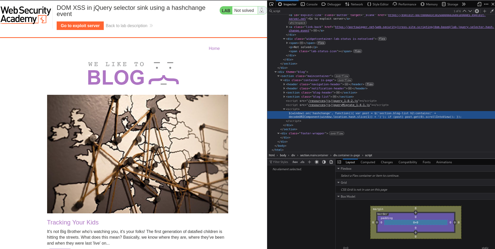
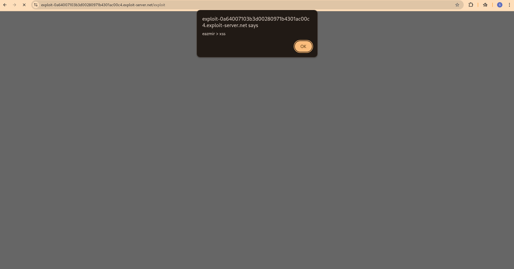

## Description
    DOM XSS in jQuery selector sink using a hashchange event

## Attack Diagram

<p align="center">
  
</p>

## Vulnerability Details

<p align="left">
  
</p>

# What is this vulnerability?

This is a DOM-based XSS that happens when developers use location.hash (the part after # in a URL)
directly in jQuery selectors like $(location.hash) without checking it first. If the page listens for hashchange events
and uses that hash value right away, an attacker can put dangerous code in the hash and trick the browser into running it.

## Why does this happen?

Sometimes, developers trust the hash in the URL and use it directly in jQuery. But jQuery treats that value like a CSS selector — and if it’s something like HTML or JavaScript, it can break out and run code.

# How the attack works

Write a malicious value
Something like: 
```html

```
Add it to a URL:

```html
https://example.com/page# XSS")>
```
Send it to the victim:
  -Email
  -Social media
  -Malicious site
  -Fake ads

# As we can see, when we send the malicious URL to the victim, the code gets executed.

<p align="left">
  
</p>

# You can exploit this vulnerability in PortSwigger using this payload:

```html
<iframe src="https://0a24000303dfd02a805f1c5100a2007a.web-security-academy.net/#" onload="this.src += encodeURIComponent('')"></iframe>
```


